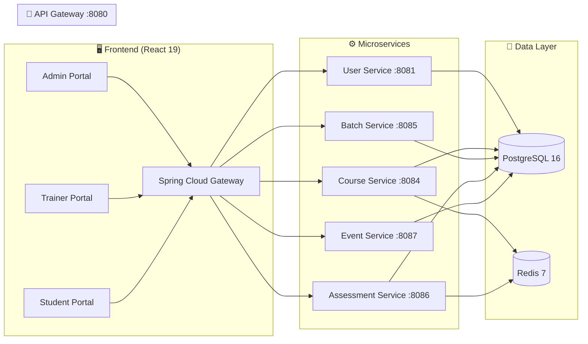
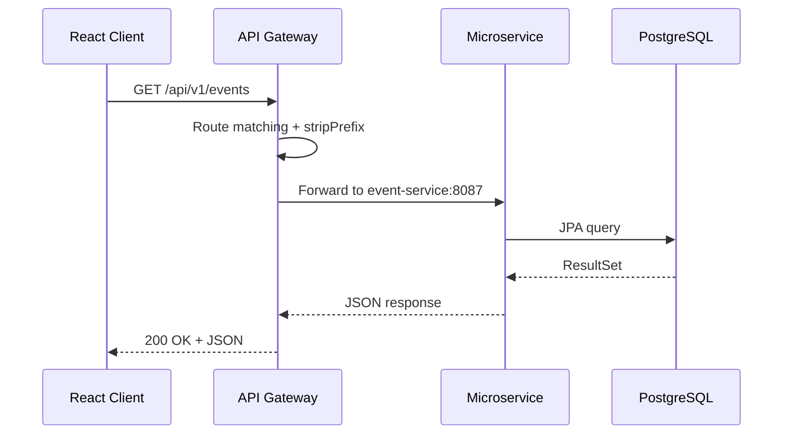
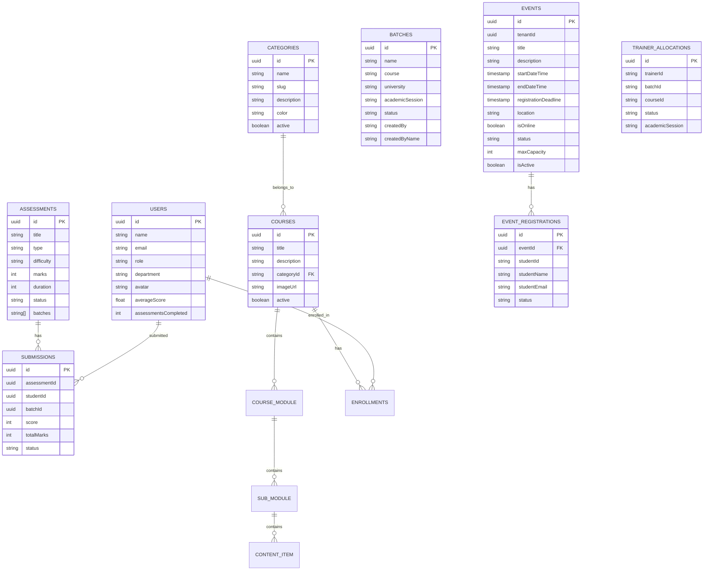

<div align="center">

# 🎓 Xebia Enterprise LMS

**A full-stack, enterprise-grade Learning Management System for managing courses, assessments, batches, events, and trainer allocations at scale.**


An enterprise LMS featuring three portal roles (Admin, Trainer, Student), a microservices backend with 6 Spring Boot services, a React 19 frontend with TanStack Router, and a Docker-based development environment. Built for Xebia to deliver structured learning with assessments, course management, batch allocation, event hosting, and rich analytics dashboards.

[**Live Demo**](#) · [**Report Bug**](https://github.com/mritunjai-prog/Xebia-Enterprise-LMS/issues) · [**Request Feature**](https://github.com/mritunjai-prog/Xebia-Enterprise-LMS/issues)

</div>

---

### Live Links

| Service | URL |
|---------|-----|
| Frontend (Vercel) | [xebia-enterprise-lms.vercel.app](https://xebia-enterprise-lms.vercel.app) |
| API Gateway | [xebia-api-gateway-mritunjai.onrender.com](https://xebia-api-gateway-mritunjai.onrender.com) |
| Course Service | [xebia-course-service-mritunjai.onrender.com](https://xebia-course-service-mritunjai.onrender.com) |
| User Service | [xebia-user-service-mritunjai.onrender.com](https://xebia-user-service-mritunjai.onrender.com) |
| Batch Service | [xebia-batch-service-mritunjai.onrender.com](https://xebia-batch-service-mritunjai.onrender.com) |
| Assessment Service | [xebia-assessment-service-mritunjai.onrender.com](https://xebia-assessment-service-mritunjai.onrender.com) |
| Event Service | [xebia-event-service-mritunjai.onrender.com](https://xebia-event-service-mritunjai.onrender.com) |
| PostgreSQL | `xebia-postgres-mritunjai` (Render managed) |

---

## 📑 Table of Contents

- [Features](#-features)
- [Tech Stack](#-tech-stack)
- [Architecture](#-architecture)
- [Getting Started](#-getting-started)
- [API Documentation](#-api-documentation)
- [Database Schema](#-database-schema)
- [Folder Structure](#-folder-structure)
- [Deployment](#-deployment)
- [Roadmap](#-roadmap)
- [Contributing](#-contributing)
- [License](#-license)

---

## 🚀 Features

### ✅ Implemented

**Admin Portal**
- ✅ Dashboard with KPI metrics and charts
- ✅ Category management (CRUD)
- ✅ Course management with module/submodule/content builder
- ✅ Curriculum builder with hierarchical content structure
- ✅ Batch Management — Overview, Analytics, Allocation Matrix, Trainer Allocation Wizard, Trainer Workload
- ✅ Assessment Management — Dashboard, Analytics, Student Reports
- ✅ Event Management — Create, edit, delete events with DateTimePicker, image upload, draft/publish
- ✅ Analytics Hub — 12+ analytics pages (Executive, Coverage, Hours, Pillars, AI, Certifications, Programs, Trends, Effectiveness, Champions, Investment, Apprentice Journey)
- ✅ Organiser page

**Trainer Portal**
- ✅ Trainer Dashboard
- ✅ Batch management
- ✅ Assessment Builder with question types (MCQ, Coding, Mixed, True/False, Multi-Select)
- ✅ Student evaluation and grading
- ✅ Leaderboard and reports
- ✅ Event viewing (read-only)
- ✅ Settings

**Student Portal**
- ✅ Student Dashboard with progress tracking
- ✅ Course browsing and enrollment
- ✅ Batch viewing
- ✅ Assessment taking (MCQ, Coding, Mixed)
- ✅ Results with certificates
- ✅ Notifications and feedback
- ✅ Event discovery and registration
- ✅ Profile management

**Backend**
- ✅ 6 microservices (API Gateway, User, Course, Batch, Assessment, Event)
- ✅ Bulk User creation API (`POST /api/v1/users/bulk`)
- ✅ Multi-tenant architecture with `TenantScopedEntity`
- ✅ Docker Compose orchestration
- ✅ API Gateway routing with service discovery

### 🚧 In Progress / Planned

- 🚧 JWT authentication (currently using fake-auth pattern)
- 🚧 WebSocket real-time notifications
- 🚧 Course video streaming
- 🚧 Mobile responsive optimization
- 🚧 Unit and integration test suites

---

## 🛠 Tech Stack

| Layer | Technology | Version | Purpose |
|-------|-----------|---------|---------|
| **Frontend** | React | 19.2 | UI library |
| **Routing** | TanStack Router | 1.168 | File-based routing with type safety |
| **Build Tool** | Vite | 8.0 | Fast dev server and bundler |
| **Styling** | Tailwind CSS | 4.2 | Utility-first CSS framework |
| **UI Components** | shadcn/ui | — | 46 accessible Radix UI components |
| **State (UI)** | Zustand | 5.0 | Lightweight UI state management |
| **State (Data)** | React Context | — | Domain data (LMSContext) |
| **Charts** | Recharts | 2.15 | Interactive data visualizations |
| **Animations** | Framer Motion | 12.4 | Declarative animations |
| **Forms** | React Hook Form + Zod | 7.71 / 3.24 | Form handling and validation |
| **Backend Framework** | Spring Boot | 3.3.6 | Java microservices |
| **API Gateway** | Spring Cloud Gateway | 2023.0.4 | Request routing and CORS |
| **Language** | Java | 17 | Backend runtime |
| **Database** | PostgreSQL | 16 | Primary data store |
| **Cache** | Redis | 7 | Session and data caching |
| **Containerization** | Docker Compose | — | Multi-service orchestration |
| **Build Tool** | Maven | 3.9.6 | Java dependency management |

---

## 🏗 Architecture

### System Overview

The application follows a **microservices architecture** with a single API Gateway acting as the entry point. The React frontend communicates exclusively through the gateway, which routes requests to the appropriate backend service.



### Request Flow



---

## 🚀 Getting Started

### Prerequisites

| Tool | Version | Download |
|------|---------|----------|
| Node.js | 18+ | [nodejs.org](https://nodejs.org/) |
| Java JDK | 17+ | [adoptium.net](https://adoptium.net/) |
| Docker | 24+ | [docker.com](https://www.docker.com/) |
| Docker Compose | 2.20+ | Included with Docker Desktop |
| Git | 2.40+ | [git-scm.com](https://git-scm.com/) |

### Installation

**1. Clone the repository**
```bash
git clone https://github.com/mritunjai-prog/Xebia-Enterprise-LMS.git
cd Xebia-Enterprise-LMS
```

**2. Start the backend services (Docker)**
```bash
cd backend
docker compose up --build -d
```

This starts 8 containers: API Gateway, User Service, Course Service, Batch Service, Assessment Service, Event Service, PostgreSQL, and Redis.

**3. Install frontend dependencies**
```bash
cd ..
npm install
```

**4. Start the frontend dev server**
```bash
npm run dev
```

The app will be available at **http://localhost:3000**.

### Verifying the Setup

1. **Frontend**: Open `http://localhost:3000` — you should see the login page
2. **Backend Gateway**: Visit `http://localhost:8080/api/v1/users` — should return `[]` (empty array)
3. **Docker Status**: Run `docker ps` — all 8 containers should show `Up` status

---

## 📡 API Documentation

### User Service (`/api/v1/users`)

| Method | Endpoint | Description |
|--------|----------|-------------|
| GET | `/api/v1/users` | List all users (optional `?role=` filter) |
| POST | `/api/v1/users` | Create a single user |
| POST | `/api/v1/users/bulk` | Bulk create users (JSON array, any size) |

### Course Service (`/api/courses`, `/api/categories`)

| Method | Endpoint | Description |
|--------|----------|-------------|
| GET | `/api/courses` | List all courses |
| POST | `/api/courses` | Create a course |
| PUT | `/api/courses/{id}` | Update a course |
| DELETE | `/api/courses/{id}` | Delete a course |
| GET | `/api/categories` | List all categories |
| POST | `/api/categories` | Create a category |
| GET | `/api/enrollments` | List enrollments |
| POST | `/api/enrollments` | Enroll in a course |
| GET | `/api/progress` | Get progress data |

### Batch Service (`/api/v1/batches`)

| Method | Endpoint | Description |
|--------|----------|-------------|
| GET | `/api/v1/batches` | List all batches |
| POST | `/api/v1/batches` | Create a batch |
| GET | `/api/v1/batches/{id}` | Get batch details |
| PUT | `/api/v1/batches/{id}` | Update a batch |
| DELETE | `/api/v1/batches/{id}` | Delete a batch |
| POST | `/api/v1/batches/{id}/students` | Enroll student in batch |

### Trainer Allocation Service (`/api/v1/allocations`)

| Method | Endpoint | Description |
|--------|----------|-------------|
| GET | `/api/v1/allocations` | List all allocations |
| POST | `/api/v1/allocations` | Create allocation |
| DELETE | `/api/v1/allocations/{id}` | Delete allocation |
| GET | `/api/v1/allocations/dashboard` | Allocation dashboard KPIs |
| GET | `/api/v1/allocations/analytics` | Allocation analytics |

### Assessment Service (`/api/v1/assessments`)

| Method | Endpoint | Description |
|--------|----------|-------------|
| GET | `/api/v1/assessments` | List all assessments |
| POST | `/api/v1/assessments` | Create assessment |
| PUT | `/api/v1/assessments/{id}` | Update assessment |
| DELETE | `/api/v1/assessments/{id}` | Delete assessment |
| GET | `/api/v1/assessments/dashboard` | Admin dashboard data |
| GET | `/api/v1/assessments/analytics` | Admin analytics data |
| POST | `/api/v1/submissions` | Submit assessment attempt |
| GET | `/api/v1/submissions` | List submissions |

### Event Service (`/api/v1/events`)

| Method | Endpoint | Description |
|--------|----------|-------------|
| GET | `/api/v1/events` | List all events |
| POST | `/api/v1/events` | Create event |
| GET | `/api/v1/events/{id}` | Get event details |
| PUT | `/api/v1/events/{id}` | Update event |
| DELETE | `/api/v1/events/{id}` | Soft-delete event |
| POST | `/api/v1/events/{id}/register` | Register for event |
| DELETE | `/api/v1/events/{id}/register` | Cancel registration |
| GET | `/api/v1/events/{id}/registration-status` | Check registration |
| GET | `/api/v1/events/{id}/registrations` | List event registrants |
| GET | `/api/v1/events/registrations/my` | My registrations |

---

## 🗄 Database Schema

### Entity Relationship Diagram



---

## 📁 Folder Structure

```
Xebia-Enterprise-LMS/
├── src/                              # React frontend source
│   ├── routes/                       # TanStack Router file-based routes
│   │   ├── admin/                    # Admin portal routes (28 files)
│   │   │   ├── analytics/            # 12+ analytics pages
│   │   │   ├── batches/              # Batch management routes
│   │   │   ├── assessments/          # Assessment management routes
│   │   │   ├── courses/              # Course management routes
│   │   │   ├── categories/           # Category management routes
│   │   │   ├── curriculum/           # Curriculum builder routes
│   │   │   └── events/               # Event management routes
│   │   ├── student/                  # Student portal routes (16 files)
│   │   └── trainer/                  # Trainer portal routes (9 files)
│   ├── admin/                        # Admin portal pages & components
│   │   ├── pages/                    # Page components
│   │   │   ├── Batches/              # Batch overview, analytics, allocation
│   │   │   ├── Assessments/          # Assessment overview, analytics, detail
│   │   │   ├── Events/               # Event list, create/edit
│   │   │   ├── Categories/           # Category CRUD
│   │   │   ├── Courses/              # Course CRUD + content manager
│   │   │   ├── Dashboard/            # Admin dashboard
│   │   │   ├── Analytics/            # Analytics hub
│   │   │   └── Curriculum/           # Curriculum builder
│   │   ├── components/               # Admin-specific components
│   │   ├── features/                 # Analytics feature components
│   │   ├── services/                 # Admin API service
│   │   └── store/                    # Zustand store
│   ├── components/                   # Shared components
│   │   ├── ui/                       # 46 shadcn/ui components
│   │   ├── layout/                   # Unified sidebar, header
│   │   ├── assessment-admin/         # Assessment cards, report table
│   │   ├── assessment-builder/       # Question builder panels
│   │   ├── analytics/                # 16 analytics sub-components
│   │   └── lms-sections.js           # LMS section definitions
│   ├── pages/                        # Student/trainer portal pages
│   │   └── Events/                   # Student & trainer event pages
│   ├── context/                      # React Context (LMSContext)
│   ├── hooks/                        # Custom hooks (useAnalyticsData)
│   ├── services/                     # Unified API service (api.js)
│   ├── utils/                        # Utility functions
│   └── assets/                       # Images, logos
│
├── backend/                          # Spring Boot microservices
│   ├── docker-compose.yml            # Orchestrates all 8 containers
│   ├── pom.xml                       # Parent Maven POM
│   ├── common-lib/                   # Shared library (BaseEntity, TenantScopedEntity, security)
│   ├── api-gateway/                  # Spring Cloud Gateway (:8080)
│   ├── user-service/                 # User management (:8081)
│   ├── course-service/               # Courses, categories, enrollments (:8084)
│   ├── batch-service/                # Batches, trainer allocations (:8085)
│   ├── assessment-service/           # Assessments, submissions, AI (:8086)
│   └── event-service/                # Events, registrations (:8087)
│
├── .mimocode/                        # AI planning documents
│   └── plans/                        # Module implementation plans
├── docs/                             # Documentation
└── package.json                      # Frontend dependencies
```

---

## 🚢 Deployment

### Docker (Recommended for Backend)

```bash
cd backend
docker compose up --build -d
```

### Frontend Build

```bash
npm run build        # Production build
npm run preview      # Preview production build locally
```

### Render.com Deployment

All backend services are deployed on Render using `render.yaml`:

```bash
# Render auto-deploys from render.yaml on push to connected branch
# Services: API Gateway, User, Course, Batch, Assessment, Event, PostgreSQL
```

- Frontend is deployed on Vercel
- Backend services are deployed on Render (Docker-based)
- PostgreSQL is managed by Render

### Environment Variables

<details>
<summary><strong>Backend Environment Variables</strong></summary>

| Variable | Service | Description | Default |
|----------|---------|-------------|---------|
| `SERVER_PORT` | All | Service port | Varies per service |
| `DB_HOST` | All | PostgreSQL host | `localhost` |
| `DB_NAME` | All | Database name | `postgres` |
| `DB_USERNAME` | All | Database user | `postgres` |
| `DB_PASSWORD` | All | Database password | — |
| `REDIS_HOST` | Gateway, Course, Assessment | Redis host | `localhost` |
| `JWT_SECRET` | All | JWT signing secret | — |
| `SERVICES_COURSE` | Gateway | Course service URL | `http://course-service:8084` |
| `SERVICES_USER` | Gateway | User service URL | `http://user-service:8081` |
| `SERVICES_BATCH` | Gateway | Batch service URL | `http://batch-service:8085` |
| `SERVICES_ASSESSMENT` | Gateway | Assessment service URL | `http://assessment-service:8086` |
| `SERVICES_EVENT` | Gateway | Event service URL | `http://event-service:8087` |

</details>

<details>
<summary><strong>Frontend Environment Variables</strong></summary>

| Variable | Description | Example |
|----------|-------------|---------|
| `VITE_API_BASE_URL` | Backend API base URL | `http://localhost:8080/api` |
| `VITE_CLOUDINARY_CLOUD_NAME` | Cloudinary cloud name | `your-cloud-name` |
| `VITE_CLOUDINARY_UPLOAD_PRESET` | Cloudinary upload preset | `your-preset` |

</details>

---

## 📋 Roadmap

### Phase 1 — Core Platform ✅
- [x] Admin portal with dashboard, categories, courses, curriculum
- [x] Student portal with course browsing, assessment taking, results
- [x] Trainer portal with assessment builder, evaluation, leaderboard
- [x] Microservices backend with API Gateway routing

### Phase 2 — Batch & Allocation Management ✅
- [x] Batch Management module (overview, analytics, allocation matrix)
- [x] Trainer Allocation Wizard (4-step flow)
- [x] Trainer Workload monitoring
- [x] Batch entity tracking (createdBy, createdByName)

### Phase 3 — Assessment Enhancement ✅
- [x] Admin Assessment Management (dashboard, analytics, student reports)
- [x] Assessment card styling matching category pattern
- [x] Compact KPI card layout (2x3 grid)
- [x] Analytics chart optimization (fit on one screen)

### Phase 4 — Event Management ✅
- [x] Event CRUD with DateTimePicker, image upload
- [x] Student event registration and cancellation
- [x] Trainer event viewing
- [x] Draft/Publish event workflow

### Phase 5 — Infrastructure ✅
- [x] Docker Compose orchestration (8 services)
- [x] Bulk User creation API
- [x] Sidebar navigation fixes (dedup, section-based filtering)
- [x] CORS consolidation (single authority at gateway)

### Phase 6 — Infrastructure ✅
- [x] Render.com deployment (6 microservices + PostgreSQL)
- [x] Docker Compose orchestration (8 services)

---

## 🤝 Contributing

### Branch Naming
- `feature/<module-name>` — New features
- `fix/<issue-description>` — Bug fixes
- `refactor/<component>` — Code refactoring

### Commit Messages
```
feat: Add Event Management module with admin CRUD
fix: Sidebar duplication on dropdown toggle
refactor: Replace MetricCard with KpiCard for consistent styling
```

### Pull Request Process
1. Fork the repository
2. Create a feature branch from `lms-integrate`
3. Make your changes and test locally
4. Ensure `npm run build` passes (frontend)
5. Ensure Docker services build successfully (backend)
6. Submit a PR with a clear description

### Coding Standards
- **Frontend**: ESLint + Prettier (pre-configured), Tailwind CSS for styling
- **Backend**: Spring Boot conventions, `ddl-auto: update` for schema management
- **Components**: Reuse existing shadcn/ui components, match the design system
- **Color palette**: `#6C1D5F` (primary), `#84117C` (secondary), `#01AC9F` (teal), `#FF6200` (orange)

---

## 👥 Contributors

| Name | Role | GitHub |
|------|------|--------|
| Mritunjai Singh | Full-Stack Developer / Project Lead | [@mritunjai-prog](https://github.com/mritunjai-prog) |
| Manish Kumawat | Full-Stack Developer | [@ManishKumawat450](https://github.com/ManishKumawat450) |
| Vijay Menaria | Full-Stack Developer | [@vijaymenaria04](https://github.com/vijaymenaria04) |
| Vinit Menaria | Full-Stack Developer | [@Vinit1120](https://github.com/Vinit1120) |
| Abhijeet Tiwari | Full-Stack Developer | [@Abhijeet0Tiwari](https://github.com/Abhijeet0Tiwari) |

---

## 📄 License

This project is private and proprietary. License to be decided.

---

## 🙏 Acknowledgements

- **[Lovable](https://lovable.dev)** — AI-powered full-stack development platform
- **[shadcn/ui](https://ui.shadcn.com)** — Beautiful, accessible component library
- **[TanStack](https://tanstack.com)** — Type-safe routing and data fetching
- **[Recharts](https://recharts.org)** — Composable charting library
- **[Framer Motion](https://www.framer.com/motion)** — Production-ready animation library
- **[Spring Boot](https://spring.io/projects/spring-boot)** — Enterprise Java framework
- **[Spring Cloud Gateway](https://spring.io/projects/spring-cloud-gateway)** — API gateway for microservices
- **[Xebia](https://xebia.com)** — Enterprise technology consultancy
